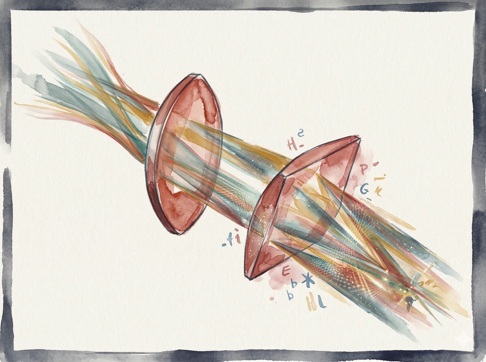

## freestyle: a tiny, fun LLM chainer

> *Just email 'em.*

A minimal LLM pipeline orchestrator. `pip install freestyle` into any project, write a `.toml`, and start routing text through models. No framework required.

---

## Quickstart

```bash
# requires: httpx tomllib (Python 3.11+ has tomllib built in)
pip install httpx

# run the built-in example (writes example.toml and runs it)
python freestyle.py --example

# run your own pipeline
python freestyle.py mypipeline.toml

# pipe text in
echo "Explain CRISPR" | python freestyle.py mypipeline.toml

# preview the execution graph without calling any models
python freestyle.py mypipeline.toml --dry-run
```

Requires [Ollama](https://ollama.ai) running locally, or set `OPENAI_BASE`
and `OPENAI_API_KEY` for any OpenAI-compatible backend.

---



## How it works

**freestyle** is designed like a telescope for information: text passes through successive lenses (models) that modify it. To make things simple to understand for us and for the LLMs, the messages are structured like an email:

| Email concept | freestyle concept | TOML mechanism               |
|---------------|-------------------|------------------------------|
| To            | pipe              | `from = "lens_id"`           |
| CC            | fork              | multiple lenses, same `from` |
| BCC           | silent fork       | `bcc = true` + `sink_id`     |
| Reply-To      | feedback loop     | `from` pointing back up      |
| Forward       | spawn sub-pipeline| `emit = "toml"` + `spawn = true` |
| Filter rule   | conditional route | `gate = true` + `routes = {}` |
| Attachment    | file source/sink  | `type = "file"`              |

---

## Full schema reference

```toml
[pipeline]
name        = "my_pipeline"   # required
version     = "0.1"
description = "optional"
author      = "optional"

# ── source: where text enters ────────────────────────────────
[source]
type = "stdin"          # stdin | text | file | http
text = "inline text"    # if type = "text"
path = "input.txt"      # if type = "file"
url  = "https://..."    # if type = "http"

# ── lens: a model call ───────────────────────────────────────
[[lens]]
id          = "my_lens"          # unique identifier
model       = "qwen2.5:0.5b"    # any ollama model string
system      = "You are..."       # system prompt = letterhead
from        = "source"           # upstream id (string or array)
temperature = 0.7                # optional

# merge strategy when from = [array]
merge_strategy = "concat"        # concat | interleave | xml_tagged

# gate: route text to one of several downstream lenses
gate   = true
routes = { science = "sci_lens", news = "news_lens", _default = "generic_lens" }

# bcc: silent fork to a named sink
bcc     = true
sink_id = "log_file"

# spawn: treat output as a sub-pipeline toml and run it
emit  = "toml"
spawn = true

# ── sink: where text exits ───────────────────────────────────
[[sink]]
id     = "main_out"
type   = "stdout"        # stdout | file | http
from   = "my_lens"

# file sink
type   = "file"
path   = "output.txt"    # .jsonl extension → append mode

# http sink
type   = "http"
url    = "https://..."
method = "POST"
```

---

## Environment variables

| Variable          | Default                    | Purpose                        |
|-------------------|----------------------------|--------------------------------|
| `OLLAMA_BASE`     | `http://localhost:11434`   | Ollama server URL              |
| `OPENAI_BASE`     | *(empty)*                  | OpenAI-compatible base URL     |
| `OPENAI_API_KEY`  | *(empty)*                  | API key for non-Ollama backends|
| `FREESTYLE_MODEL` | `qwen3:0.6b`             | Default model if not specified |

---

## Design notes

- **The graph is implicit in `from`.** No separate topology block.
  Arrays mean merge; a string means pipe. That's the whole graph.
- **Models are correspondents, not tools.** The `system` prompt is a
  letterhead — it tells the model who it is in this thread.
- **The Wizard is the only moving part.** ~350 lines, no framework
  dependencies beyond `httpx`. Install this repo, type `freestyle`, done. You bring the models/APIs.
- **Spawn carefully.** `emit = "toml"` + `spawn = true` enables
  recursive sub-pipelines. Max depth is 5 by default.

---

*Imagine what could happen 🪄*
